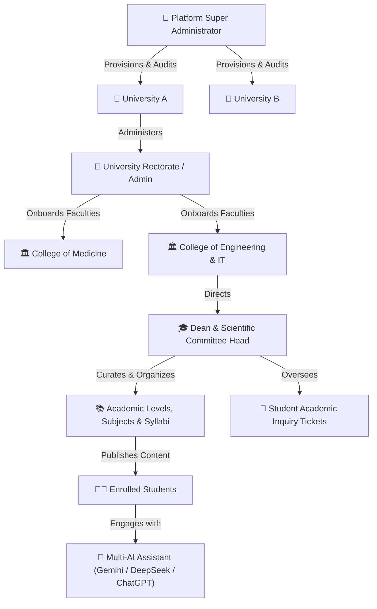
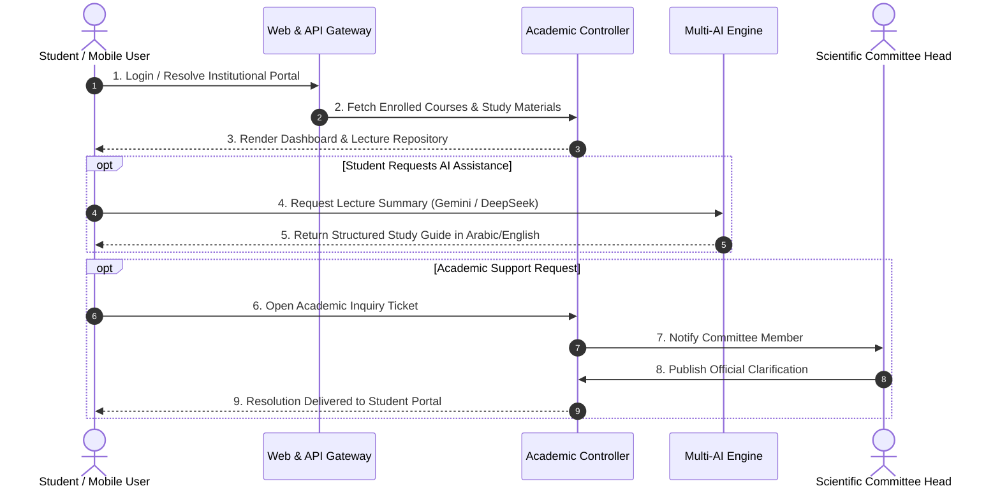

# Scientific Committee Platform (منصة إدارة اللجان العلمية والمحتوى الأكاديمي)

<p align="center">
  
</p>

<p align="center">
  <strong>An Enterprise-Grade, 3-Tier Multi-Tenant Academic Committee & E-Learning Orchestration Platform with Integrated Multi-AI Intelligence</strong>
</p>

<p align="center">
  
  
  
  
  
  
</p>

---

## 📌 Notice
> [!IMPORTANT]
> **This public repository serves as an architectural whitepaper, technical portfolio showcase, and product demonstration.**
> The underlying source code, algorithms, and database infrastructure are **closed-source and proprietary**.
> 
> For live demonstrations, university institutional licensing, or commercial inquiries, please refer to the [Contact & Live Demo](#-contact--live-demo) section.

---

## 📖 Executive Summary

The **Scientific Committee Platform** is a modern, scalable educational ecosystem developed to solve the challenges of higher education governance, departmental scientific committee coordination, and academic content distribution.

Rather than relying on disjointed messaging groups, unorganized cloud drives, or rigid traditional LMS platforms, this platform unites university leadership, college deaneries, department scientific committees, and students into an integrated, role-governed environment featuring real-time **Multi-Model Artificial Intelligence (Gemini, DeepSeek, ChatGPT)**.

---

## 🏛 3-Tier Multi-Tenant Architecture

The system is designed with a multi-tenant hierarchy allowing a single central installation to power multiple universities and autonomous faculties:



### Key Architectural Highlights:
1. **Dynamic Tenant Isolation:** The core engine (`InstitutionResolver`) dynamically scopes databases, themes, branding, and permissions by subdomain, slug, or institutional session token.
2. **Modular MVC Pattern:** Strictly separates domain logic (Models), request routing and security (Controllers), and presentation templates (Views).
3. **Environment Auto-Detection:** Automatically switches between local development configurations and production cloud clusters without code modification.

---

## 🤖 Integrated Multi-AI Educational Assistant

The platform introduces a centralized AI gateway (`AiService`) connecting three leading AI intelligence models to assist students and instructors:

<table align="center">
  <tr>
    <th width="33%">✨ Google Gemini (v1beta Flash)</th>
    <th width="33%">🧠 DeepSeek (V3 Chat)</th>
    <th width="33%">⚡ OpenAI ChatGPT</th>
  </tr>
  <tr>
    <td>High-speed summarization of multi-page academic textbooks, lecture slides, and curriculum outlines into concise bullet points.</td>
    <td>Complex STEM reasoning, code analysis, mathematical step-by-step breakdowns, and structured technical logic.</td>
    <td>Academic writing improvement, grammar checking, translation, and natural language academic dialogue.</td>
  </tr>
</table>

Each institution can independently configure their preferred model, customize prompt templates, and provision their own institutional API keys via their administrative dashboard.

---

## 🌟 Core Functional Capabilities

### 1. 🎓 Academic Content & Syllabus Management
- Categorized taxonomy: **University ➔ College ➔ Academic Level ➔ Subject / Course ➔ Lecture Modules**.
- Support for lecture notes, slides, recorded video links, reference manuals, and previous examination papers.

### 2. 🎫 Academic Inquiry & Support Ticket System
- Direct communication channel between students and departmental scientific committees.
- Status tracking, priority tagging, and automated resolution notices.

### 3. 📱 Mobile Application Gateway (REST API)
- Cross-origin (CORS) enabled JSON endpoints designed for companion mobile applications (such as Flutter).
- Native endpoints for authentication, syllabus navigation, material downloads, and mobile AI chat.

### 4. 🎨 Institution Whitelabeling & Custom Branding
- Independent institutional dashboards allow faculties to upload official university logos, favicons, custom themes, and localized guidelines.

---

## 🔄 Interaction & Operational Flow



---

## 🛠 Engineering & Technology Stack

- **Backend Architecture:** Native PHP (MVC Object-Oriented Framework).
- **Persistence Layer:** MySQL Relational Database (Strict foreign keys & cascading constraints).
- **Security:** PDO Prepared Statements, BCRYPT password hashing, Role-Based Access Control (RBAC), and multi-tenant scoping guards.
- **Frontend Layer:** Responsive HTML5 / CSS3 / JavaScript with full Right-to-Left (RTL) Arabic typography and dark-mode compatibility.
- **AI Integrations:** Google Generative AI REST API, DeepSeek OpenAI-compatible API, and OpenAI REST API.
- **Mobile Support:** RESTful JSON API Gateway.

---

## 📬 Contact & Live Demo

Are you interested in deploying the **Scientific Committee Platform** for your university, faculty, or educational institution?

- **Developer & Solution Architect:** Amged Alfadly
- **GitHub Profile:** [@Amged-Alfadly](https://github.com/Amged-Alfadly)
- **Live Demo Request:** Contact via GitHub or email to request access to the live demonstration environment and administrative credentials.
- **Licensing & Customization:** Institutional on-premise deployment, cloud hosting, and custom feature development are available upon request.

---

## 📄 Intellectual Property & Legal Notice

```text
Copyright (c) 2024-2026 Amged Alfadly. All Rights Reserved.
The architecture, designs, interface mockups, and intellectual concepts displayed 
in this showcase are protected by international intellectual property laws.
```
